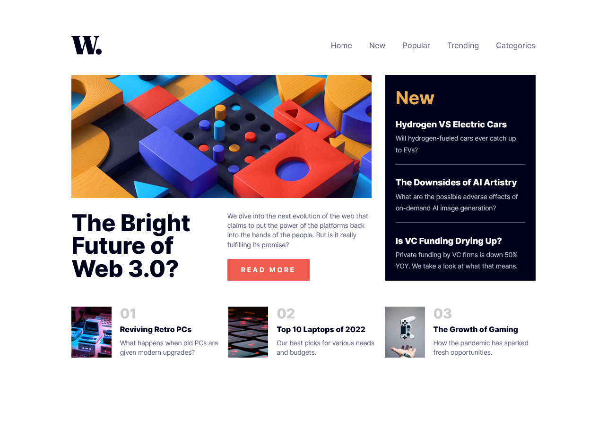
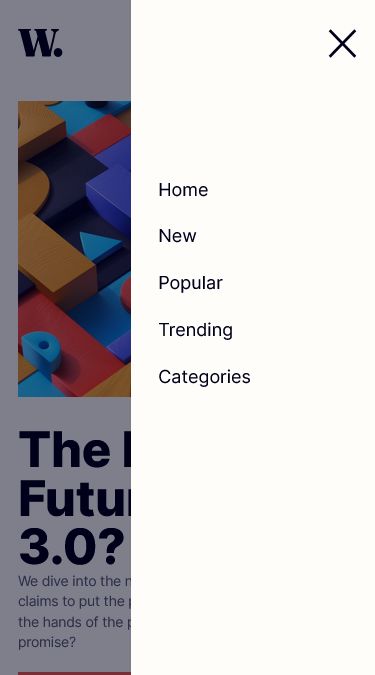

# Frontend Mentor - News homepage solution

This is a solution to the [News homepage challenge on Frontend Mentor](https://www.frontendmentor.io/challenges/news-homepage-H6SWTa1MFl). Frontend Mentor challenges help you improve your coding skills by building realistic projects.

## Table of contents

- [Overview](#overview)
  - [The challenge](#the-challenge)
  - [Screenshot](#screenshot)
  - [Links](#links)
- [My process](#my-process)
  - [Built with](#built-with)
  - [What I learned](#what-i-learned)
  - [Continued development](#continued-development)
  - [Useful resources](#useful-resources)
- [Author](#author)
- [Acknowledgments](#acknowledgments)

## Overview

- Responsive News Homepage Using CSS Grid and Flexbox with working mobile navigation.

### The challenge

Users should be able to:

- View the optimal layout for the interface depending on their device's screen size
- See hover and focus states for all interactive elements on the page

### Screenshot




### Links

- Solution URL: [Solution URL](https://github.com/Techies101/News-Homepage)
- Live Site URL: [Live Site URL](https://techies101.github.io/News-Homepage/)

## My process

### Built with

- Semantic HTML5 markup
- CSS custom properties
- Flexbox
- CSS Grid
- Mobile-first workflow

### What I learned

- From this challenges I learned the basic javascript for mobile navigation see the code snippet below how I did the mobile navigation.
- I learned how HTML Semantics works
- I learned new CSS property

```javascript
const btnEl = document.querySelector(".btn-mobile-nav");
const headerEl = document.querySelector(".header");

btnEl.addEventListener("click", function () {
  headerEl.classList.toggle("nav-open");
});

If you want more help with writing markdown, we'd recommend checking out [The Markdown Guide](https://www.markdownguide.org/) to learn more.

### Continued development

I want to continue focusing on using CSS Grid and Flexbox for future projects and other CSS property.

## Author

- Frontend Mentor - [@EyetecSolution](https://www.frontendmentor.io/profile/EyetecSolution)
```
